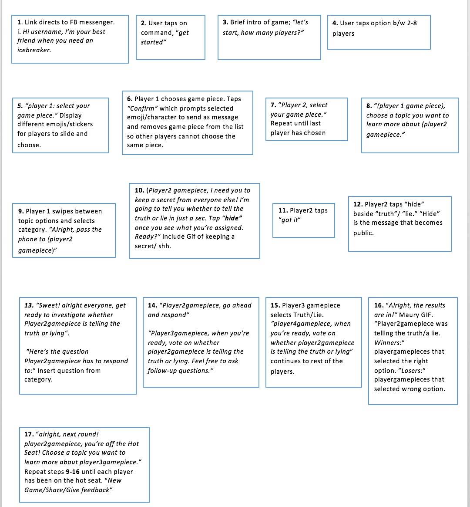

# Gameplay

### Objectives
What are the objectives of the game?
 - To be answer a question in a certain way (by telling the truth or lying) without giving it away.
 - Be able to pick up on whether others are answer the question in a truthful manner or not.
 - If there are other investigators, work with them to be able to come to an agreement on whether the teller is telling the truth or not.

### Game Progression and Play Flow
How does the game flow for the game player?

### Mission/challenge Structure
- Player mission is to get a set number of points through successfully carrying out the above objectives.

### Puzzle Structure
N/A
