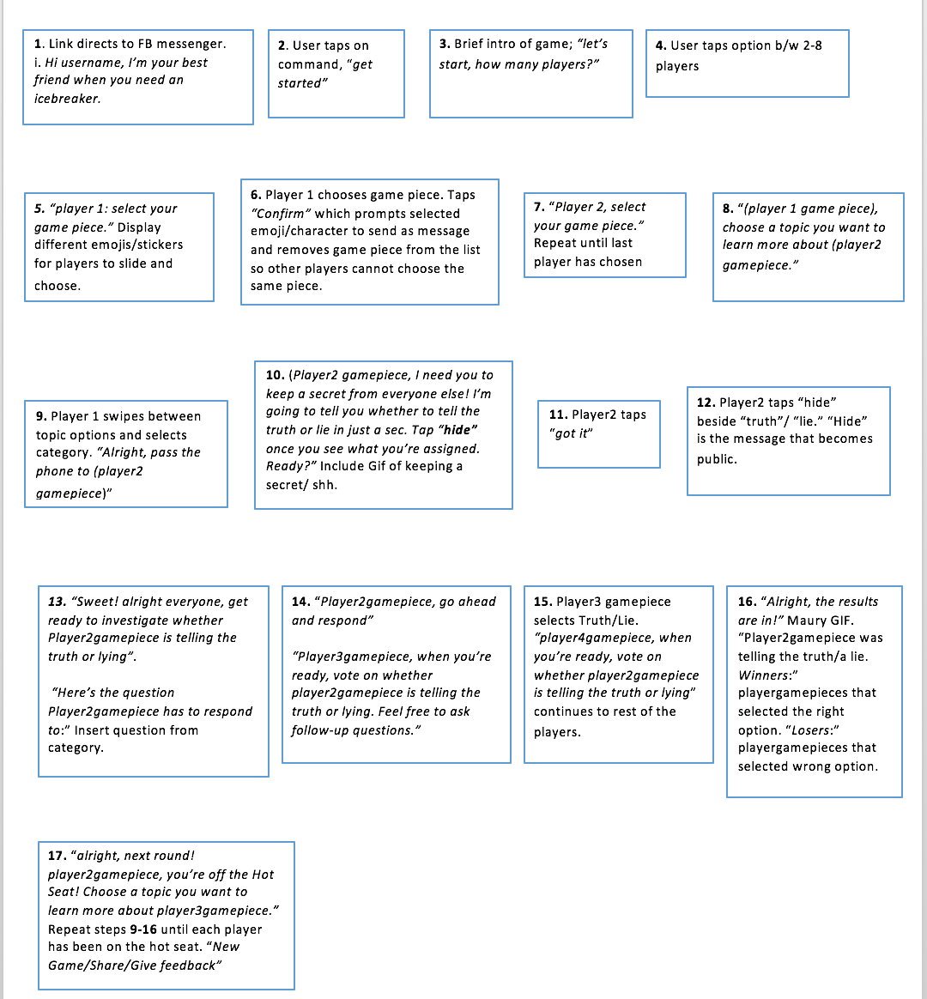

# Mechanics

### Rules
Include both implicit and explicit rules.
- Teller and investigator have unlimited time to elaborate the story or ask follow up questions respectively.
- If investigator is able to guess correctly if the teller is telling the truth or lie, the teller has to remain in the hot seat.
- If the investigator guesses incorrectly, he/she takes the role of the teller.
- The first player to remain in the hot seat three times in a row loses.

### Model of the game universe.
Think of it as a simulation of a world, how do all the pieces
interact?

### Physics
How does the physical universe work?

N/A

### Economy
What is the economy of the game? How does it work?
- Point system
- Wager points against opponents through gameplay
- Reward for certain amount of points?

### Character movement in the game
N/A

### Objects
How to pick them up and move them.
- Cards for topics
- Bars for evaluation

### Actions
Including whatever switches and buttons are used, interacting with objects, and
what means of communication are used.
- Cards are touched to activate a question pertaining to a specific topic.
- Bars are used to evaluate the teller's authenticity in their answers.

### Combat
If there is combat or even conflict, how is this specifically modeled?

N/A

### Screen Flow
How each screen is related to every other and a description of the purpose
of each screen.

### Game Options
What are the options and how do they affect game play?
Flow of Gameplay:
- Investigator: Choose the topic for the teller to talk about.
- Teller: Receives instructions on whether to lie or tell the truth.
- Both: Question revealed.
- Teller: Answers the question.
- Investigator: Decides if it was true or false.
- If investigator is correct, teller remains in the hot seat, otherwise roles switched.
- Repeat until one player is on the hot seat three times consecutively.

### Replaying and saving

### Cheats and Easter Eggs

