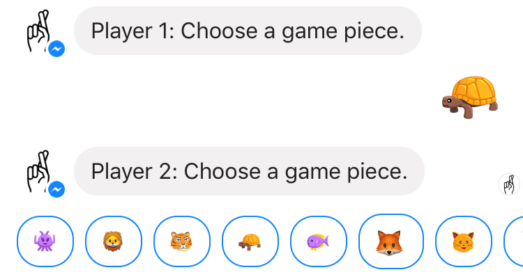

# Game Overview

### Game Concept
- Player chooses a topic and receives a question
- Have to tell lie or truth.
- Other player has to evaluate whether player is telling truth.
  - Can ask follow up questions.

### Target Audience
18 - 30 year olds wanting to know each other better.

### Genre(s)
Casual, strategy, multiplayer, roleplay.

### Purpose of the Game
**Pedagogical objective(s) for educational games, training goal, or
intended social impact.**
- Changing user behavior to improve conversational skills through better questions.
- Reveal player's personalities, feelings and beliefs in a fun and engaging way.
- Fostering closeness with mutual vulnerability.

### Look and Feel
**What is the basic look and feel of the game? What is the visual style?**
- Recognizable Facebook Messenger environment.
- No timer.
- Fun game icons to represent players, question topics, and game mechanics.

### Intended Use
**How will the game be inserted into a pedagogical scenario or how will it
be used in training, therapy, rehabilitation, etc?**

- Can be used for dating, interviewing, networking and other group settings
  where asking good questions and listening are critical skills.
